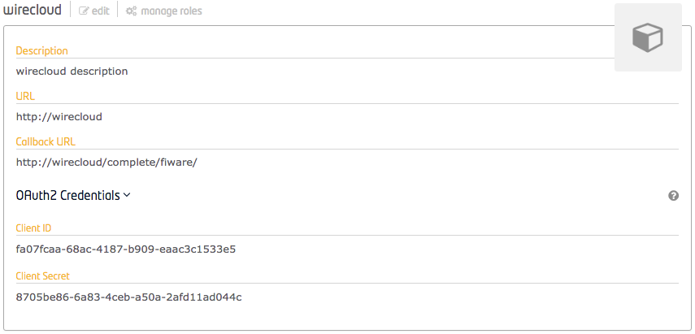
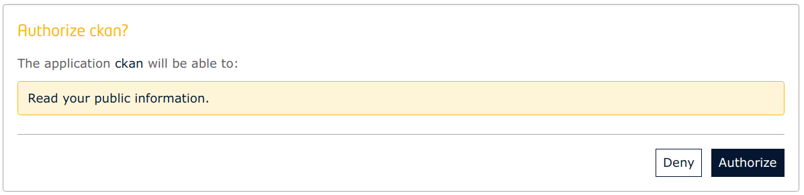
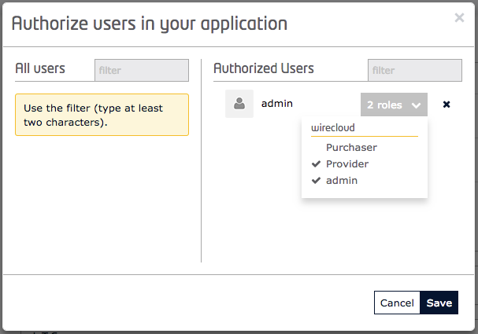
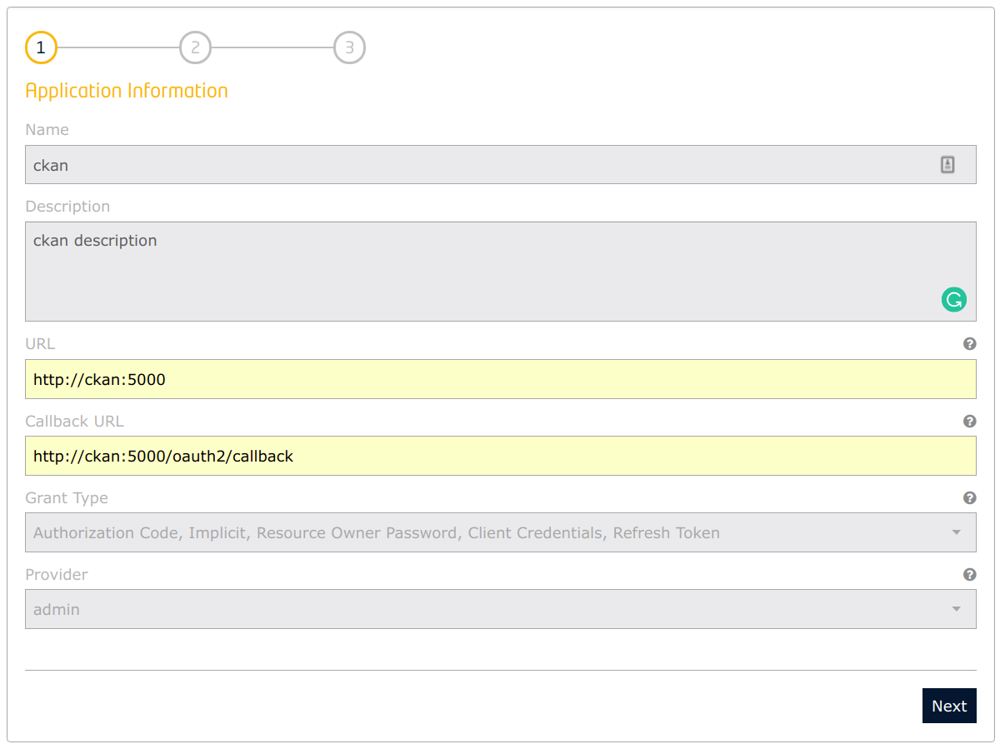
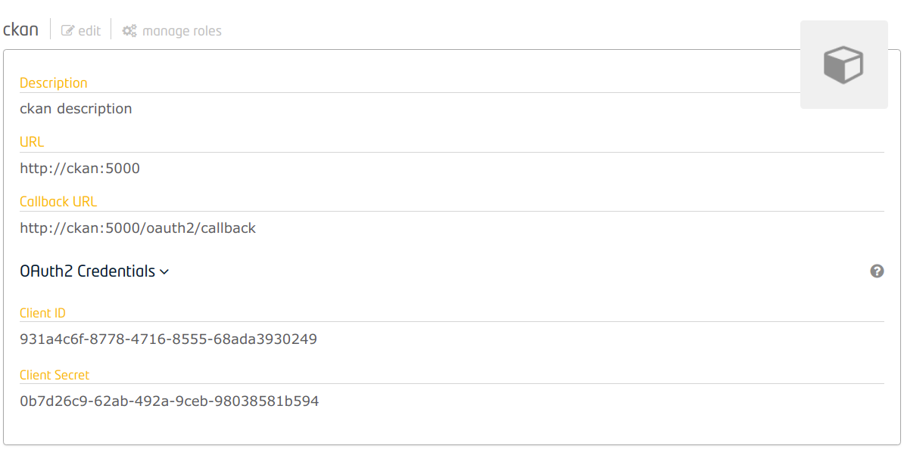
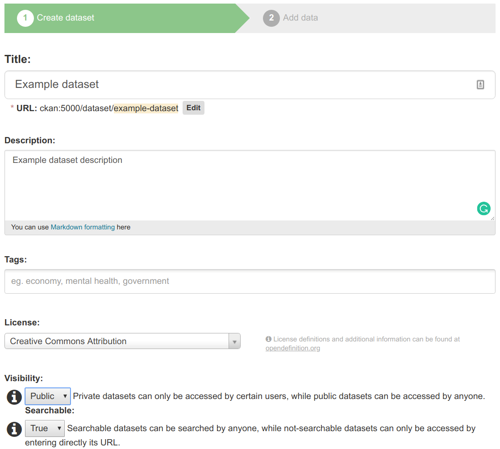
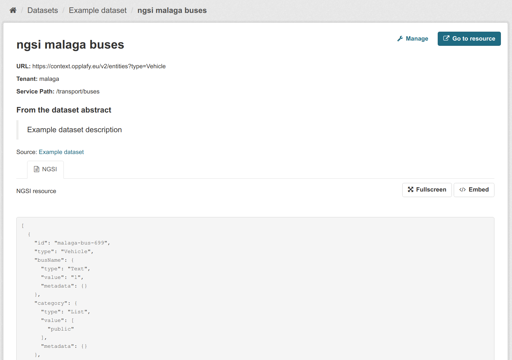

# Instructions

## 1. Launch the IdM

The first task is to launch the Identity Manager and to create two applications on it that will authenticate against its users: ckan and wirecloud.

For launching only the IdM (using configs on Keyrock section of `.env`` such as disable HTTPS):

    docker-compose up -d keyrock

Open a browser on `https://keyrock:3443`, dodge the security warning and enter with default credentials `admin@test.com` and `1234`.

> Your Keyrock instance does have only the default admin user. Please update it and/or create additional users by following the [Identity-Management](https://github.com/Fiware/tutorials.Identity-Management) tutorial.

## 2. Launch WireCloud

WireCloud can use its own user database, but it can also use Keyrock IdM for that purpose. For connecting WireCloud with Keyrock, on this latter a new application is to be created. The parameters for creating a new application for authenticating WireCloud users are:

* URL: `<wc-server>`, ej: `http://wirecloud`
* Callback URL: `<wcc-server>/complete/fiware/`, ej: `http://wirecloud/complete/firewall/`

    > Please note the `/` in the end of the Callback URL, it is required.

In this case, the default roles `Provider` and `Purchaser` are not enough, and a new role `admin` has to be created (or in the application creation wizard or in the application role management section. This role is to be assigned to authorized users that we want to become WireCloud administrators.

Look for the oauth2 credentials in the description of the created application. The important contents are the strings of the **Client ID** and the **Client Secret**.

These credentials are to be inserted in the WireCloud image upon its startup. For doing so, WireCloud services on the `docker-compose.yml` use the WireCloud section of `.env` for defining environment variables. Edit the file `.env` and paste those strings on the `SOCIAL_AUTH_FIWARE_KEY` and `SOCIAL_AUTH_FIWARE_SECRET` respectively:

    SOCIAL_AUTH_FIWARE_KEY=fa07fcaa-68ac-4187-b909-eaac3c1533e5
    SOCIAL_AUTH_FIWARE_SECRET=8705be86-6a83-4ceb-a50a-2afd11ad044c

`wirecloud`  service can now be started. Configurations are described in the WireCloud section of the `.env` file:

    docker-compose up -d wirecloud

WireCloud instance is running in `http://wirecloud`. Login with one of the existing Keyrock users and do authorize the application:

**Create a superuser**

It is recommended to create a superuser. In an standalone application it is done through the command `manage.py createsuperuser` (possibly using `exec` docker commands). But in a WireCloud instance linked to an IdM, it has to be done assigning the previously created role `admin` to a user (that has to have logged previously).

Open Keyrock interface and access the application created for authenticating WireCloud. In the _authorized users_ section click the button `Authorize` and assign to the desired user(s) the `admin` role.

## 3. Launch CKAN

CKAN instance is going to be authenticated against the keyrock IdM. For doing so, create an application for CKAN in keyrock, on the applications section of the main menu or in the Applications section. Use the following data:

* URL: `<ckan-server>`, ej: `http://ckan:5000`
* Callback URL: `<ckan-server>/oauth2/callback`, ej: `http://ckan:5000/oauth2/callback`

Leave the default roles `Provider` and `Purchaser` on the app and finish it.

Look for the oauth2 credentials in the description of the created application. The important contents are the strings of the **Client ID** and the **Client Secret**.

These credentials are to be inserted in the CKAN image upon its startup. For doing so, CKAN services on the `docker-compose.yml` uses the CKAN section of `.env` file for defining environment variables. Edit the file `.env` and paste those strings on the `CKAN_OAUTH2_CLIENT_ID` and `CKAN_OAUTH2_CLIENT_SECRET` respectively:

    CKAN_OAUTH2_CLIENT_ID=931a4c6f-8778-4716-8555-68ada3930249
    CKAN_OAUTH2_CLIENT_SECRET=0b7d26c9-62ab-492a-9ceb-98038581b594

CKAN service can now be started. Prior to that, the file `ckan-env.sh` has to be executed so as it defines the environment variables in the shell session:

    docker-compose up -d ckan

CKAN instance is running in `http://ckan:5000`. Login with one of the existing Keyrock users and do authorize the ckan application:

> The current CKAN image does not allow creation of new datasets to users not in organizations. An edition has to be done in a file inside `ckan` container with vim or the editor of your choice (none is preinstalled, though), setting to `true` the shown properties:
>
>        docker-compose exec ckan bash
>        root@1234567890ab:/# apt update
>        root@1234567890ab:/# apt -y install vim
>        root@1234567890ab:/# vim /etc/ckan/default/production.ini
>        ...
>          ckan.auth.create_unowned_dataset = true
>          ckan.auth.create_dataset_if_not_in_organization = true
>        ...
>        [save]
>        root@1234567890ab:/# apache2ctl graceful
>        root@1234567890ab:/# exit

After that, the logged user should be able to create a new dataset:

### 5. CKAN and WireCloud connections

**Create a dashboard for the wizard**

The wizard inside CKAN that helps creating NGSI data is based on a dashboard that has to be created and made public by a user (a WireCloud superuser, preferrably). So a new dashboard has to be created. Click on the options button, click on `Create a new workspace` and assign it the name `dashcreator`. A new empty workspace appears. If done on user `admin`, the id of the dashboard is `admin/dashcreator`, that will be used later.

TODO: Initial set of widgets and operators for graphs and wizard have to be uploaded to "My Resources"

The dashboard is composed of a widget and an operator. The operator is in charge of reading the HTTP GET request made by _CKAN WireCloud Views_ extension and access the CKAN metadata of the corresponding dataset, and the widget will receive this information and will allow to define different parameters to be inserted in the data visualization dashboard. The widget `NGSI dashboard creator` has to be added to the interface and, in the _wiring_ tool, a new instance of the operator `CKAN metadata operator` has to be added and linked to the widget as in this figure. 

> Since no dataset information is being received inside WireCloud (only when being executed from within the CKAN extension), an error migh appear. Please ignore it.

Finally, the dashboard must be made **public**. On the `share` option of the dashboard, mark it as `public` so the CKAN extension can make use of it.

**Re-launch CKAN so as its extension make use of it**

If your dashboard is not `admin/dashcreator` (you might have chosen a different name or used a different user),  did choose a diferent name than `admin/dashcreator` (or a different user), please edit the `CKAN_WIRECLOUD_VIEW_EDITOR_DASHBOARD` property on CKAN section of `.env`, reload those settings and re-start the containers:

    docker-compose restart ckan

## 4. Link to NGSI data in CKAN

A name and description are to be provided. By now, the dataset will be created **public**.

For updating resources to the dataset, a NGSI query has to be provided. The format of the data has to be set to `fiware-ngsi`, and after selecting this option, new fields appear for inserting more Context Broker parameters:

After doing so, the resource can be visualized through the NGSI CKAN extension, that access the Context Broker and gets the current entities. Click on the resource name:

# Considerations

The structure of `docker-compose.yml` containing every serevice, tue usage of `.env` environmental variables file for the options and the requirement of modifying the `/etc/hosts` file is intentional for the sake of simplicity in the tutorial. This strategy is only for testing and learning purposes, and may not be the best one in production.

# Errors

1. Cannot upload image to keyrock as application  icon. If uploading an image to keyrock on application creation, an `ENOENT: no such file or directory, open 'public/img/applications/17a7dbff-5d08-4ba4-9456-22afee707cf4.jpg'" error is received.

# Requirements

This `docker-compose.yml` has some requirements:

* The `/etc/hosts` file of the client machine has to declare, as aliases of `127.0.0.1` the following host names: `ckan`, `wirecloud`, `keyrock`

    > If deployed externally, not `127.0.0.1` has to be aliased, but IP of the real server

        127.0.0.1   localhost ckan wirecloud keyrock

        or

        (X.X.X.X | mymachine.example.org)     ckan wirecloud keyrock

# Data

Malagaa's parkings
http://217.172.12.177:1026/v2/entities?type=OffStreetParking
Tenant: Malaga
SP: /parking/harmonized

Barcelona's air quality (¿not working?)
http://130.206.118.244:1030/v2/entities?type=AirQualityObserved

Barcelona POIs (not working)
URL: http://130.206.118.244:1030/v2/entities?type=PointOfInterest&q=address.addressLocality%3D%3D'Barcelona'

Malaga POIs (not working)
URL: http://130.206.118.244:1030/v2/entities?type=PointOfInterest&q=address.addressLocality%3D%3DM%C3%A1laga

Vvalencia POIs (not working)
URL: http://130.206.118.244:1030/v2/entities?type=PointOfInterest&q=address.addressLocality%3D%3D'Valencia'

A Coruña POIs (not working)
URL: http://130.206.118.244:1030/v2/entities?type=PointOfInterest&q=address.addressLocality%3D%3D'Coru%C3%B1a%2C%20A'

https://data.lab.fiware.org/organization/smart-cities-interoperability-lab

