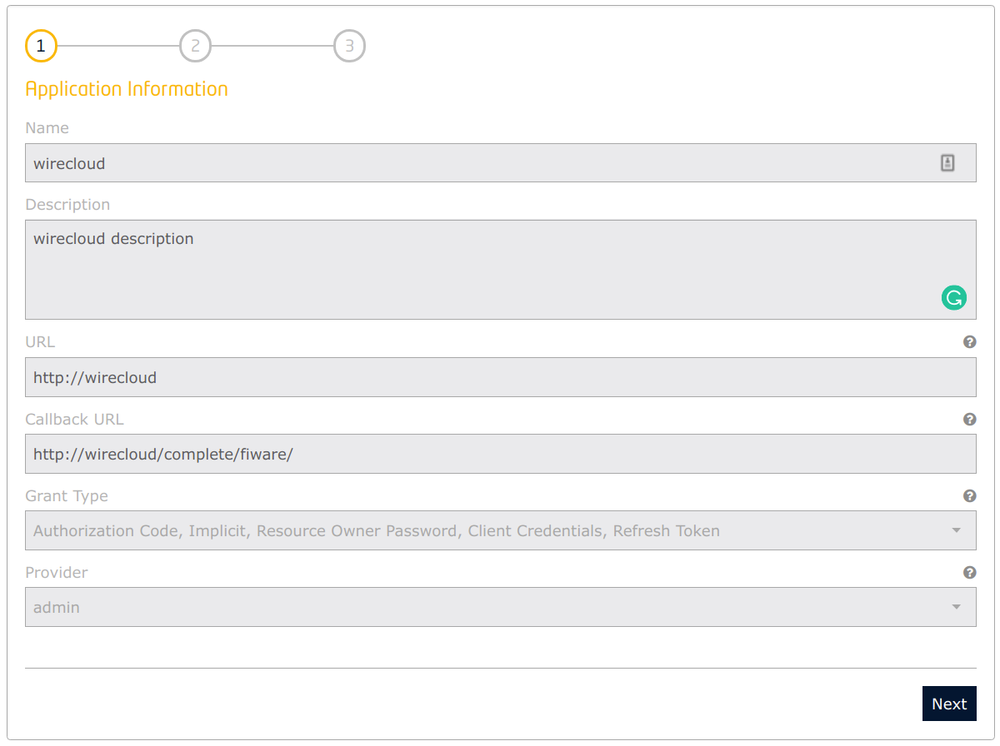

# Instructions

## 1. Launch the IdM

The first task is to launch the Identity Manager and to create two applications on it that will authenticate against its users: ckan and wirecloud.

For launching only the IdM (using configs on Keyrock section of `.env`` such as disable HTTPS):

    docker-compose up -d keyrock

Open a browser on `https://keyrock:3443`, dodge the security warning and enter with default credentials `admin@test.com` and `1234`.

> Your Keyrock instance does have only the default admin user. Please update it and/or create additional users by following the [Identity-Management](https://github.com/Fiware/tutorials.Identity-Management) tutorial.

## 2. Launch WireCloud

WireCloud can use its own user database, but it can also use Keyrock IdM for that purpose. For connecting WireCloud with Keyrock, on this latter a new application is to be created. The parameters for creating a new application for authenticating WireCloud users are:

* URL: `<wc-server>`, ej: `http://wirecloud`
* Callback URL: `<wcc-server>/complete/fiware/`, ej: `http://wirecloud/complete/firewall/`

    > Please note the `/` in the end of the Callback URL, it is required.

In this case, the default roles `Provider` and `Purchaser` are not enough, and a new role `admin` has to be created (or in the application creation wizard or in the application role management section. This role is to be assigned to authorized users that we want to become WireCloud administrators.

Look for the oauth2 credentials in the description of the created application. The important contents are the strings of the **Client ID** and the **Client Secret**.

These credentials are to be inserted in the WireCloud image upon its startup. For doing so, WireCloud services on the `docker-compose.yml` use the WireCloud section of `.env` for defining environment variables. Edit the file `.env` and paste those strings on the `SOCIAL_AUTH_FIWARE_KEY` and `SOCIAL_AUTH_FIWARE_SECRET` respectively:

    SOCIAL_AUTH_FIWARE_KEY=fa07fcaa-68ac-4187-b909-eaac3c1533e5
    SOCIAL_AUTH_FIWARE_SECRET=8705be86-6a83-4ceb-a50a-2afd11ad044c

`wirecloud`  service can now be started. Configurations are described in the WireCloud section of the `.env` file:

    docker-compose up -d wirecloud

WireCloud instance is running in `http://wirecloud`. Login with one of the existing Keyrock users and do authorize the application:

**Create a superuser**

It is recommended to create a superuser. In an standalone application it is done through the command `manage.py createsuperuser` (possibly using `exec` docker commands). But in a WireCloud instance linked to an IdM, it has to be done assigning the previously created role `admin` to a user (that has to have logged previously).

Open Keyrock interface and access the application created for authenticating WireCloud. In the _authorized users_ section click the button `Authorize` and assign to the desired user(s) the `admin` role.

## 3. Manage my WireCloud components

* Get releases from github repositories
* Add components by hand
* Add components to the folder used by docker-compose
* Placeholder for the marketplace

## 4. My first mashup

* Create a mashup
* Add a Widget (map)
* Manage settings
* Add some Operators and a basic wiring
* Finish the mashup with another widget

## 5. Next steps
